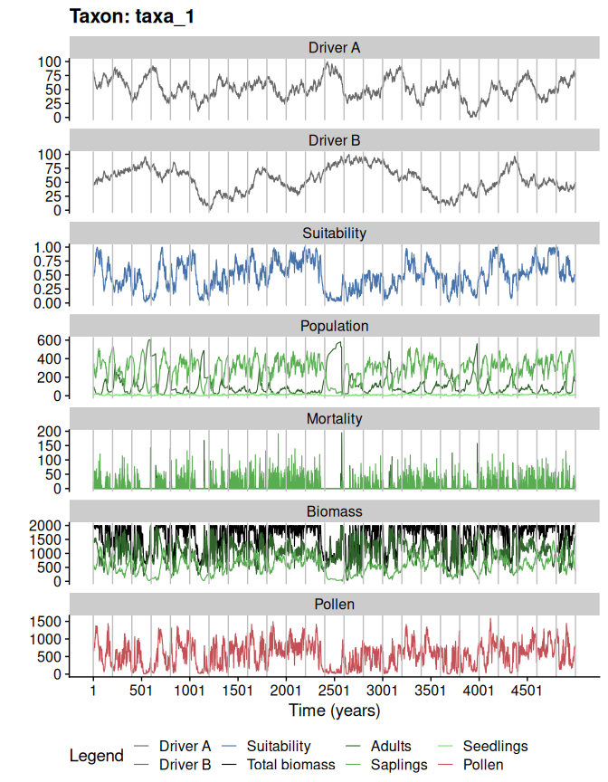

<!-- README.md is generated from README.Rmd. Please edit that file -->

# virtualPollen

[](https://CRAN.R-project.org/package=virtualPollen)
[](https://CRAN.R-project.org/package=virtualPollen)

The package `virtualPollen` simulates pollen curves over millennial
time-scales. Pollen curves are generated by virtual taxa with different
life traits (life-span, fecundity, growth-rate) and niche features
(niche position and breadth) as a response to virtual environmental
drivers with a given temporal autocorrelation. It furthers allow to
simulate specific data properties of fossil pollen datasets, such as
sediment accumulation rate, and depth intervals between consecutive
pollen samples. The simulation outcomes are useful to better understand
the role of plant traits, niche properties, and climatic variability in
defining the shape of pollen curves.

## Installation

You can install the released version of virtualPollen from
[GitHub](https://github.com/BlasBenito/virtualPollen) or soon from with:

Install from [CRAN](https://CRAN.R-project.org):

``` r
install.packages("virtualPollen")
```

Install from [GitHub](https://github.com/BlasBenito/virtualPollen):

``` r
library(remotes)
remotes::install_github("blasbenito/virtualPollen")
```

``` r
library(virtualPollen)
library(viridis)
```

## Workflow

The basic workflow to generate virtual pollen curves requires these
steps:

**1. Generate virtual drivers** with `simulateDriverS()`. The function
allows defining the names of the drivers, a random seed, a time vector,
the length of the autocorrelation structure of the driver, and the data
range. Note that the final length of the temporal autocorrelation is
only approximate, and that **time** runs from left to right, meaning
that older samples have lower time values.

Individual drivers can be generated using the function
`simulateDriver()`.

``` r
#generating two drivers with different autocorrelation lengths
env_drivers <- simulateDriverS(
 random.seeds = c(60, 120),
 time = 1:5000,
 autocorrelation.lengths = c(200, 600),
 output.min = c(0,0),
 output.max = c(100, 100),
 driver.names = c("A", "B"),
 filename = NULL
)
#> Warning: The dot-dot notation (`..scaled..`) was deprecated in ggplot2 3.4.0.
#> ℹ Please use `after_stat(scaled)` instead.
#> ℹ The deprecated feature was likely used in the virtualPollen package.
#>   Please report the issue to the authors.
#> This warning is displayed once every 8 hours.
#> Call `lifecycle::last_lifecycle_warnings()` to see where this warning was
#> generated.
```


``` r

#checking output
str(env_drivers)
#> 'data.frame':    20000 obs. of  4 variables:
#>  $ time                  : int  1 2 3 4 5 6 7 8 9 10 ...
#>  $ driver                : chr  "A" "A" "A" "A" ...
#>  $ autocorrelation.length: num  200 200 200 200 200 200 200 200 200 200 ...
#>  $ value                 : num  79.3 82.4 79.3 77.4 80.7 ...
```

**2. Define the traits of the virtual taxa**. Note that the dataframe
with the parameters can be either filled with numeric vectors, or
manually, by using the function
[editData](https://CRAN.R-project.org/package=editData). Please, check
the help of the function *parametersDataframe* to better understand the
meaning of the traits.

``` r
#generating dataframe template
taxa_traits <- parametersDataframe(rows = 2)

#checking columns in parameters
colnames(taxa_traits)
#>  [1] "label"                    "maximum.age"             
#>  [3] "reproductive.age"         "fecundity"               
#>  [5] "growth.rate"              "pollen.control"          
#>  [7] "maximum.biomass"          "carrying.capacity"       
#>  [9] "driver.A.weight"          "driver.B.weight"         
#> [11] "niche.A.mean"             "niche.A.sd"              
#> [13] "niche.B.mean"             "niche.B.sd"              
#> [15] "autocorrelation.length.A" "autocorrelation.length.B"

#filling parameters for two species

#taxa names
taxa_traits$label <- c("taxa_1", "taxa_2")

#population dynamics
taxa_traits$maximum.age <- c(50, 1000)
taxa_traits$reproductive.age <- c(10, 60)
taxa_traits$fecundity <- c(10, 2)
taxa_traits$growth.rate <- c(0.5, 0.05)
taxa_traits$pollen.control <- c(0, 0)
taxa_traits$maximum.biomass <- c(100, 100)
taxa_traits$carrying.capacity <- c(2000, 2000)

#niche properties
taxa_traits$driver.A.weight <- c(0.5, 0.5)
taxa_traits$driver.B.weight <- c(0.5, 0.5)
taxa_traits$niche.A.mean <- c(75, 50)
taxa_traits$niche.A.sd <- c(10, 10)
taxa_traits$niche.B.mean <- c(75, 50)
taxa_traits$niche.B.sd <- c(15, 15)
taxa_traits$autocorrelation.length.A <- c(200, 200)
taxa_traits$autocorrelation.length.B <- c(600, 600)

#visualizing main parameters
parametersCheck(
  parameters = taxa_traits,
  species = "all",
  drivers = env_drivers
  )
```


**3. Simulate population dynamics and pollen productivity** of the
virtual taxa.

``` r
sim <- simulatePopulation(
  parameters = taxa_traits,
  species = "all",
  drivers = env_drivers
  )
#> Simulating taxon: taxa_1
#> Simulating taxon: taxa_2

#sim is a list with two dataframes
#let's look at the first one
sim.df <- sim[[1]]
str(sim.df)
#> 'data.frame':    5500 obs. of  14 variables:
#>  $ Time                   : int  -500 -499 -498 -497 -496 -495 -494 -493 -492 -491 ...
#>  $ Pollen                 : num  2000 1784 1684 1400 1300 ...
#>  $ Population.mature      : num  20 18 17 14 13 9 7 5 5 4 ...
#>  $ Population.immature    : num  0 124 147 251 218 285 248 212 163 143 ...
#>  $ Population.viable.seeds: num  199 178 168 139 129 89 69 49 49 39 ...
#>  $ Suitability            : num  1 0.991 0.991 1 1 ...
#>  $ Biomass.total          : num  2000 2000 1998 1998 1994 ...
#>  $ Biomass.mature         : num  2000 1800 1700 1400 1300 ...
#>  $ Biomass.immature       : num  0 200 298 598 694 ...
#>  $ Mortality.mature       : num  56 0 1 0 0 1 1 0 0 1 ...
#>  $ Mortality.immature     : num  20 75 155 64 172 62 126 105 98 69 ...
#>  $ Driver.A               : num  NA NA NA NA NA NA NA NA NA NA ...
#>  $ Driver.B               : num  NA NA NA NA NA NA NA NA NA NA ...
#>  $ Period                 : chr  "Burn-in" "Burn-in" "Burn-in" "Burn-in" ...

#note that "Time" has negative values
#they define a burn-in period used
#to warm-up the simulation.
#it can be removed with:
sim.df <- sim.df[sim.df$Time > 0, ]


#plotting the simulation
plotSimulation(
  simulation.output = sim,
  line.size = 0.4
  )
```



``` r
#comparing pollen curves for a given time
compareSimulations(
  simulation.output = sim,
  species = "all",
  columns = c("Suitability", "Pollen"),
  time.zoom = c(2000, 3000),
  text.size = 14
  )
```


**4. Generate a virtual accumulation rate**. The function
`simulateAccumulationRate()` simulates varying accumulation rates in the
pollen data resulting from the simulation. Users can also apply their
own accumulation rates, as long as the data has the same estructure as
the output of `simulateAccumulationRate()`.

``` r

#simulationg accumulation rate
accumulation_rate <- simulateAccumulationRate(
 seed = 50,
 time = 1:5000,
 output.min = 10,
 output.max = 40,
 direction = -1,
 plot = TRUE
 )
```


``` r

#checking the output
str(accumulation_rate)
#> 'data.frame':    5000 obs. of  3 variables:
#>  $ time             : int  1 2 3 4 5 6 7 8 9 10 ...
#>  $ accumulation.rate: num  40 39 39 39 39 39 39 39 39 39 ...
#>  $ grouping         : num  1 1 1 1 1 1 1 1 1 1 ...
#all samples in sim with the same grouping variable
#are to be aggregated into the same centimeter (in the next step)
```

**5.Apply the virtual accumulation rate** to the simulated pollen, and
sample the outcome at different **depth intervals**.

``` r
#sampling at: every cm, 2 cm and 3 cm between samples
sim.aggregated <- aggregateSimulation(
  simulation.output = sim,
  accumulation.rate = accumulation_rate,
  sampling.intervals = c(2,4)
)
```

The output is a matrix-like list, where rows are simulated taxa, the
first column contains the original data, the second column contains the
pollen data aggregated by the accumulation rate, and the rest of the
columns represent the different sampling intervals.


**6.Optional: re-interpolate the data into a regular time grid**.
Comparing the different pollen curves through methods such as regression
requires them to be in the same temporal grid (a.k.a, have the same
number of cases). The function *toRegularTime* handles that seamlessly.

``` r
#interpolating at 50 years resolution.
sim.regular <- toRegularTime(
  x = sim.aggregated,
  time.column = "Time",
  interpolation.interval = 50,
  columns.to.interpolate = c("Suitability", "Pollen")
)
#> Warning in sqrt(sum.squares/one.delta): NaNs produced

#> Warning in sqrt(sum.squares/one.delta): NaNs produced

#> Warning in sqrt(sum.squares/one.delta): NaNs produced

#> Warning in sqrt(sum.squares/one.delta): NaNs produced

#> Warning in sqrt(sum.squares/one.delta): NaNs produced

#> Warning in sqrt(sum.squares/one.delta): NaNs produced

#> Warning in sqrt(sum.squares/one.delta): NaNs produced

#simulated pollen
plot(
  sim.regular[[1,1]]$Time,
  sim.regular[[1,1]]$Pollen,
  type = "l", 
  xlim = c(1000, 2000),
  ylim = c(0, 1200),
  ylab = "Pollen",
  xlab = "Time (years)",
  col = viridis::viridis(4)[4]
  )

#aggregated by accumulation rate
lines(
  sim.regular[[1,2]]$Time, 
  sim.regular[[1,2]]$Pollen,
  col = viridis::viridis(4)[3]
  )

#sampling every 2cm
lines(
  sim.regular[[1,3]]$Time,
  sim.regular[[1,3]]$Pollen,
  col = viridis::viridis(4)[2]
  )

#sampling every 4cm
lines(
  sim.regular[[1,4]]$Time, 
  sim.regular[[1,4]]$Pollen,
  col = viridis::viridis(4)[1]
  )

legend(
  "topleft",
  legend = c(
    "Raw pollen",
    "Accumulated pollen",
    "2cm samples",
    "4cm samples"
  ),
  col = viridis::viridis(4)[4:1],
  lty = 1,
  bty = "n"
)
```


