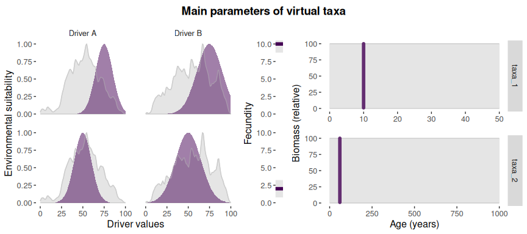
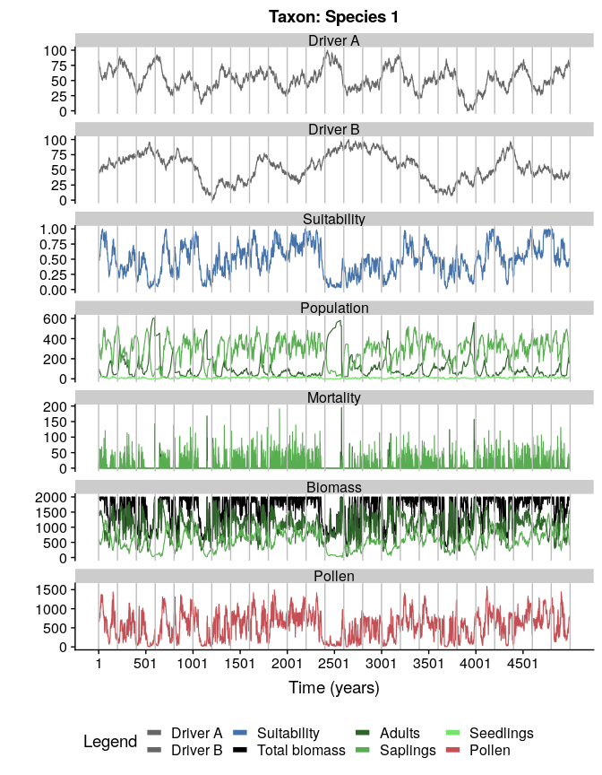

<!-- README.md is generated from README.Rmd. Please edit that file -->
[](https://travis-ci.org/BlasBenito/virtualPollen)

virtualPollen
=============

The goal of virtualPollen is to provide the tools to simulate pollen curves over millenial time-scales generated by virtual taxa with different life traits (life-span, fecundity, growth-rate) and niche features (niche position and breadth) as a response to virtual environmental drivers with a given temporal autocorrelation. It furthers allow to simulate specific data properties of fossil pollen datasets, such as sediment accumulation rate, and depth intervals between consecutive pollen samples. The simulation outcomes are useful to better understand the role of plant traits, niche properties, and climatic variability in defining the shape of pollen curves.

Installation
------------

You can install the released version of virtualPollen from [GitHub](https://github.com/BlasBenito/virtualPollen) or soon from [CRAN](https://CRAN.R-project.org) with:

``` r
#from GitHub
library(devtools)
install_github("blasbenito/virtualPollen")

#from CRAN (not yet)
install.packages("virtualPollen")
```

``` r
library(virtualPollen)
library(viridis)
#> Loading required package: viridisLite
```

Workflow
--------

The basic workflow consists of the following steps:

**1.** **Generate virtual drivers** with *simulateDriverS*. The user can define a random seed, a time vector, length of the autocorrelation structure of the driver, minimum and maximum values, and names of the drivers. Note that the final length of the temporal autocorrelation is only approximate, and that **time** runs from left to right, meaning that older samples have lower time values.

``` r
#generating two drivers with different autocorrelation lengths
myDrivers <- simulateDriverS(
 random.seeds=c(60, 120),
 time=1:5000,
 autocorrelation.lengths=c(200, 600),
 output.min=c(0,0),
 output.max=c(100, 100),
 driver.names=c("A", "B"),
 filename=NULL
)
```


``` r

#checking output
str(myDrivers)
#> 'data.frame':    20000 obs. of  4 variables:
#>  $ time                  : int  1 2 3 4 5 6 7 8 9 10 ...
#>  $ driver                : chr  "A" "A" "A" "A" ...
#>  $ autocorrelation.length: num  200 200 200 200 200 200 200 200 200 200 ...
#>  $ value                 : num  79.3 82.4 79.3 77.4 80.7 ...

#note that individual drivers can be created
#with the function simulateDriver as well
```

**2.** **Define the traits of the virtual taxa**. Note that the dataframe with the parameters can be either filled with numeric vectors, or manually, by using the function [editData](https://cran.r-project.org/web/packages/editData/README.html). Please, check the help of the function *parametersDataframe* and the vignette to better understand the meaning of the traits.

``` r
#generating template of the dataframe
myParameters <- parametersDataframe(rows=2)

#checking columns in parameters
str(myParameters)
#> 'data.frame':    2 obs. of  16 variables:
#>  $ label                   : logi  NA NA
#>  $ maximum.age             : logi  NA NA
#>  $ reproductive.age        : logi  NA NA
#>  $ fecundity               : logi  NA NA
#>  $ growth.rate             : logi  NA NA
#>  $ pollen.control          : logi  NA NA
#>  $ maximum.biomass         : logi  NA NA
#>  $ carrying.capacity       : logi  NA NA
#>  $ driver.A.weight         : logi  NA NA
#>  $ driver.B.weight         : logi  NA NA
#>  $ niche.A.mean            : logi  NA NA
#>  $ niche.A.sd              : logi  NA NA
#>  $ niche.B.mean            : logi  NA NA
#>  $ niche.B.sd              : logi  NA NA
#>  $ autocorrelation.length.A: logi  NA NA
#>  $ autocorrelation.length.B: logi  NA NA

#filling it with vectors
myParameters[1,] <- c("Species 1", 50, 10, 10, 0.5, 0, 100, 2000, 0.5, 0.5, 75, 10, 75, 15, 200, 600)
myParameters[2,] <- c("Species 2", 1000, 60, 2, 0.05, 0, 100, 2000, 0.5, 0.5, 50, 10, 50, 15, 200, 600)

#fixing column types
myParameters <- fixParametersTypes(x = myParameters)
#> Checking taxon Species 1
#> Checking taxon Species 2

#visualizing main parameters
parametersCheck(parameters = myParameters, 
                species = "all",
                drivers = myDrivers)
```


**3.** **Simulate population dynamics and pollen productivity** of the virtual taxa.

``` r
#simulating population dynamics
mySimulation <- simulatePopulation(parameters = myParameters,
                                   species = "all",
                                   drivers = myDrivers)
#> Simulating taxon: Species 1
#> Simulating taxon: Species 2

#mySimulation is a list with two dataframes
#let's look at the first one
mySimulation.df <- mySimulation[[1]]
str(mySimulation.df)
#> 'data.frame':    5500 obs. of  14 variables:
#>  $ Time                   : int  -500 -499 -498 -497 -496 -495 -494 -493 -492 -491 ...
#>  $ Pollen                 : num  1997 1881 1485 1299 1099 ...
#>  $ Population.mature      : num  20 19 15 13 11 9 7 4 4 2 ...
#>  $ Population.immature    : num  0 63 251 275 262 245 220 216 140 127 ...
#>  $ Population.viable.seeds: num  199 188 148 129 109 89 69 39 39 19 ...
#>  $ Suitability            : num  1 0.991 0.991 1 1 ...
#>  $ Biomass.total          : num  1997 2000 1967 1999 1998 ...
#>  $ Biomass.mature         : num  1997 1898 1499 1299 1100 ...
#>  $ Biomass.immature       : num  0 102 469 699 899 ...
#>  $ Mortality.mature       : num  55 0 0 0 0 1 0 2 0 0 ...
#>  $ Mortality.immature     : num  20 136 0 124 142 126 114 73 115 52 ...
#>  $ Driver.A               : num  NA NA NA NA NA NA NA NA NA NA ...
#>  $ Driver.B               : num  NA NA NA NA NA NA NA NA NA NA ...
#>  $ Period                 : Factor w/ 2 levels "Burn-in","Simulation": 1 1 1 1 1 1 1 1 1 1 ...
#note that "Time" has negative values
#they define a burn-in period used
#to warm-up the simulation.
#can be removed with:
mySimulation.df <- mySimulation.df[mySimulation.df$Time > 0, ]


#plotting the simulation
plotSimulation(simulation.output = mySimulation,
               line.size = 0.4)
```



``` r
#comparing pollen curves for a given time
compareSimulations(simulation.output = mySimulation,
                   species = "all",
                   columns = c("Suitability", "Pollen"),
                   time.zoom = c(2000, 3000),
                   text.size = 14)
```


**4.** **Generate a virtual accumulation rate**. Note that virtual accumulation rates generated by the function *simulateAccumulationRate* are not intended to be realistic (similar to existing accumulation rate curves), but to provide the means to distort the pollen data in similar ways as real accumulation rate curves do. Still, the users can use their own accumulation rates, as long as they have the same estructure as the output of *simulateAccumulationRate*.

``` r

#simulationg accumulation rate
myAccumulationRate <- simulateAccumulationRate(
 seed = 50,
 time = 1:5000,
 output.min = 10,
 output.max = 40,
 direction = -1,
 plot = TRUE
 )
```


``` r

#checking the output
str(myAccumulationRate)
#> 'data.frame':    5000 obs. of  3 variables:
#>  $ time             : int  1 2 3 4 5 6 7 8 9 10 ...
#>  $ accumulation.rate: num  10 10 10 10 10 10 10 10 10 10 ...
#>  $ grouping         : num  1 1 1 1 1 1 1 1 1 1 ...
#all samples in mySimulation with the same grouping variable
#are to be aggregated into the same centimeter (in the next step)
```

**5.** Apply the **virtual accumulation rate** to the simulation, and sample the outcome at different **depth intervals**.

``` r
#applying accumulation rate and
#sampling at: every cm, 2 cm and 3 cm between samples
mySimulation.aggregated <- aggregateSimulation(
  simulation.output = mySimulation,
  accumulation.rate = myAccumulationRate,
  sampling.intervals = c(2,4)
)

#the output is a matrix-like list
#rows are simulated taxa
#first column is the original data
#second column is the data aggregated by the accumulation rate
#rest of columns represent sampling intervals

#comparing data of the first row
plot(mySimulation.aggregated[[1,1]]$Time, 
     mySimulation.aggregated[[1,1]]$Pollen,
     type = "l", 
     xlim = c(1000, 2000),
     ylim = c(0, 1200),
     ylab = "Pollen",
     xlab = "Time (years)",
     col=viridis(4)[4])
lines(mySimulation.aggregated[[1,2]]$Time, 
     mySimulation.aggregated[[1,2]]$Pollen,
     col=viridis(4)[3])
lines(mySimulation.aggregated[[1,3]]$Time, 
     mySimulation.aggregated[[1,3]]$Pollen,
     col=viridis(4)[2])
lines(mySimulation.aggregated[[1,4]]$Time, 
     mySimulation.aggregated[[1,4]]$Pollen,
     col=viridis(4)[1])
```


**6.** Optional: **re-interpolate the data into a regular time grid**. Comparing the different pollen curves through methods such as regression requires them to be in the same temporal grid (a.k.a, have the same number of cases). The function *toRegularTime* handles that seamlessly.

``` r
#interpolating at 50 years resolution.
mySimulation.regular <- toRegularTime(
  x = mySimulation.aggregated,
  time.column = "Time",
  interpolation.interval = 50,
  columns.to.interpolate = c("Suitability", "Pollen")
)
#> Warning in sqrt(sum.squares/one.delta): NaNs produced

#> Warning in sqrt(sum.squares/one.delta): NaNs produced

#> Warning in sqrt(sum.squares/one.delta): NaNs produced

#comparing interpolated data
plot(mySimulation.regular[[1,1]]$Time, 
     mySimulation.regular[[1,1]]$Pollen,
     type = "l", 
     xlim = c(1000, 2000),
     ylim = c(0, 1200),
     ylab = "Pollen",
     xlab = "Time (years)",
     col=viridis(4)[4])
#note that this function modifies the original dataset!
lines(mySimulation.regular[[1,2]]$Time, 
     mySimulation.regular[[1,2]]$Pollen,
     col=viridis(4)[3])
lines(mySimulation.regular[[1,3]]$Time, 
     mySimulation.regular[[1,3]]$Pollen,
     col=viridis(4)[2])
lines(mySimulation.regular[[1,4]]$Time, 
     mySimulation.regular[[1,4]]$Pollen,
     col=viridis(4)[1])
```


